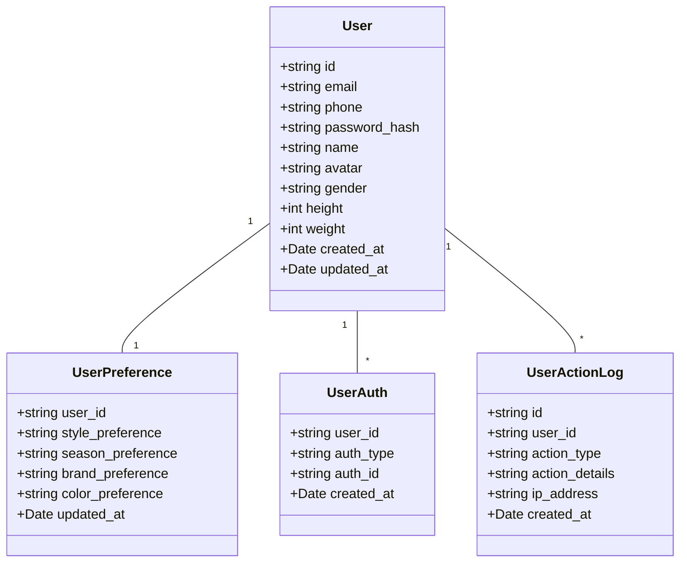
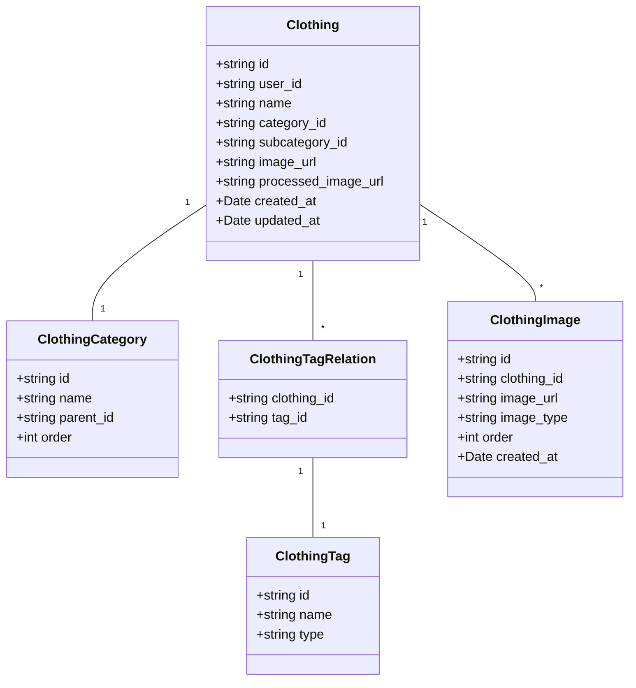
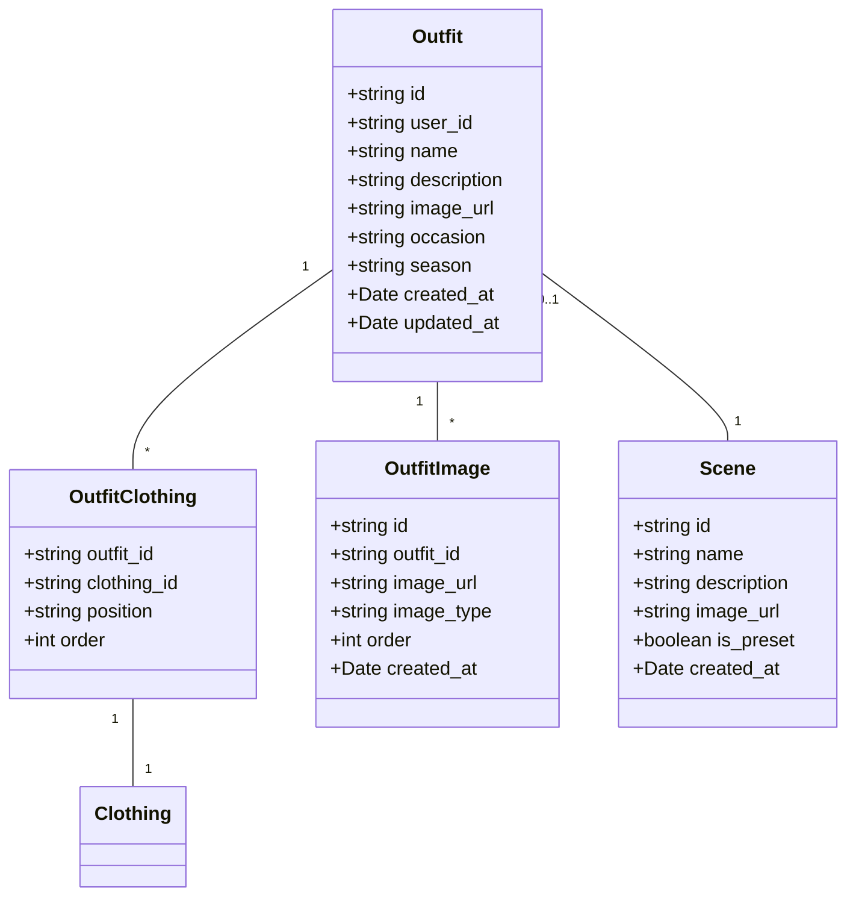
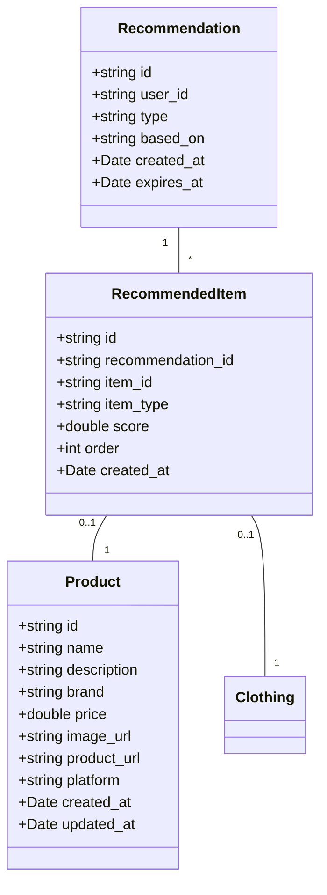
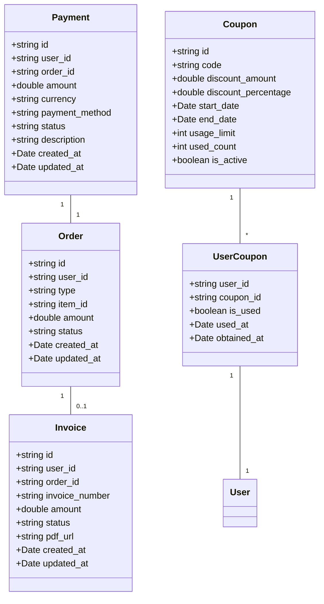

# 智能穿搭规划系统技术文档

## 1. 项目概述

智能穿搭规划系统是一个基于AI技术的个人衣橱管理和穿搭推荐平台，帮助用户实现衣物的智能化管理、搭配和推荐，提升用户的穿搭体验和时尚品味。

### 1.1 核心功能

- 用户注册、登录和个人信息管理
- 虚拟衣橱管理，包括衣物分类、图片上传和处理
- AI辅助穿搭生成和效果图展示
- 智能衣物推荐和自然语言描述解析
- 安全便捷的支付系统

### 1.2 技术文档目的

本文档详细描述了智能穿搭规划系统的技术实现细节，包括技术栈选择、系统架构、核心模块实现、数据库设计、API设计、部署方案、安全性设计、性能优化、测试策略和开发流程等，为系统的开发、测试和部署提供指导。

## 2. 技术栈选择

### 2.1 整体技术栈

| 层级 | 技术栈 | 用途 |
|------|--------|------|
| 客户端层 | React、React Native | 网页端和移动端开发 |
| API网关层 | Nginx、Kong | 请求路由、负载均衡、认证授权 |
| 服务层 | Node.js、Python、Go | 业务逻辑实现 |
| 数据层 | MySQL、MongoDB、Redis、Elasticsearch | 数据存储和检索 |
| 容器化 | Docker、Kubernetes | 容器化部署和管理 |
| 监控与日志 | Prometheus、Grafana、ELK Stack | 系统监控和日志管理 |

### 2.2 各服务技术栈

| 服务名称 | 技术栈 | 用途 |
|----------|--------|------|
| 用户服务 | Node.js + Express + MySQL | 用户注册、登录、个人信息管理 |
| 衣橱服务 | Python + Flask + MongoDB + 对象存储 | 虚拟衣橱管理、衣物图片处理 |
| 穿搭服务 | Node.js + NestJS + Redis + 对象存储 | 穿搭生成、AI效果图展示 |
| 推荐服务 | Python + FastAPI + Redis + 搜索引擎 | 智能衣物推荐、自然语言解析 |
| 支付服务 | Go + Gin + MySQL + Redis | 支付接口集成、交易记录管理 |
| AI服务 | Python + TensorFlow/PyTorch + 消息队列 | 图像分割、图生图、自然语言理解 |

## 3. 系统架构

### 3.1 整体架构

智能穿搭规划系统采用微服务架构，将系统分为多个独立的服务模块，每个模块负责特定的功能领域。系统架构分为四层：

1. **客户端层**：用户通过网页端、移动端访问系统
2. **API网关层**：处理请求路由、负载均衡、认证授权等
3. **服务层**：包含所有业务逻辑模块，如用户服务、衣橱服务、穿搭服务等
4. **数据层**：包含数据库、缓存、文件存储等

```
┌─────────────────────────────────────────────────────────────────────────┐
│                            客户端层                                      │
│  ┌─────────────┐  ┌─────────────┐  ┌─────────────┐  ┌─────────────┐     │
│  │   网页端    │  │   移动端    │  │   管理后台  │  │  第三方系统  │     │
│  └─────────────┘  └─────────────┘  └─────────────┘  └─────────────┘     │
└─────────────────────────────────────────────────────────────────────────┘
                                      │
                                      ▼
┌─────────────────────────────────────────────────────────────────────────┐
│                            API网关层                                    │
│  ┌─────────────┐  ┌─────────────┐  ┌─────────────┐  ┌─────────────┐     │
│  │  请求路由   │  │  负载均衡   │  │  认证授权   │  │  限流熔断   │     │
│  └─────────────┘  └─────────────┘  └─────────────┘  └─────────────┘     │
└─────────────────────────────────────────────────────────────────────────┘
                                      │
                                      ▼
┌─────────────────────────────────────────────────────────────────────────┐
│                            服务层                                        │
│  ┌─────────────┐  ┌─────────────┐  ┌─────────────┐  ┌─────────────┐     │
│  │  用户服务   │  │  衣橱服务   │  │  穿搭服务   │  │  推荐服务   │     │
│  └─────────────┘  └─────────────┘  └─────────────┘  └─────────────┘     │
│  ┌─────────────┐  ┌─────────────┐  ┌─────────────┐  ┌─────────────┐     │
│  │  支付服务   │  │  AI服务     │  │  商品服务   │  │  消息服务   │     │
│  └─────────────┘  └─────────────┘  └─────────────┘  └─────────────┘     │
└─────────────────────────────────────────────────────────────────────────┘
                                      │
                                      ▼
┌─────────────────────────────────────────────────────────────────────────┐
│                            数据层                                        │
│  ┌─────────────┐  ┌─────────────┐  ┌─────────────┐  ┌─────────────┐     │
│  │  MySQL      │  │  MongoDB    │  │  Redis      │  │  对象存储    │     │
│  └─────────────┘  └─────────────┘  └─────────────┘  └─────────────┘     │
│  ┌─────────────┐  ┌─────────────┐  ┌─────────────┐  ┌─────────────┐     │
│  │  搜索引擎   │  │  缓存系统   │  │  日志系统   │  │  监控系统   │     │
│  └─────────────┘  └─────────────┘  └─────────────┘  └─────────────┘     │
└─────────────────────────────────────────────────────────────────────────┘
```

### 3.2 微服务设计

#### 3.2.1 用户服务

- **功能**：处理用户注册、登录、个人信息管理、权限控制等
- **技术栈**：Node.js + Express + MySQL
- **核心模块**：
  - 认证模块：处理用户登录、注册、第三方登录
  - 个人信息模块：管理用户资料、偏好设置
  - 权限模块：实现基于角色的访问控制
  - 通知模块：处理用户通知和消息

#### 3.2.2 衣橱服务

- **功能**：管理用户的虚拟衣橱、衣物信息、图片处理等
- **技术栈**：Python + Flask + MongoDB + 对象存储
- **核心模块**：
  - 衣物管理模块：处理衣物的增删改查
  - 图片处理模块：集成AI图像分割技术
  - 分类管理模块：管理衣物分类
  - 标签管理模块：处理衣物属性标签

#### 3.2.3 穿搭服务

- **功能**：处理衣物搭配、AI生成效果图、穿搭方案管理等
- **技术栈**：Node.js + NestJS + Redis + 对象存储
- **核心模块**：
  - 搭配生成模块：处理衣物组合
  - AI渲染模块：集成AI图生图技术
  - 场景管理模块：处理多场景选择和优化
  - 方案管理模块：管理穿搭方案的保存、分享等

#### 3.2.4 推荐服务

- **功能**：处理智能衣物推荐、自然语言描述解析、商品搜索等
- **技术栈**：Python + FastAPI + Redis + 搜索引擎
- **核心模块**：
  - 推荐算法模块：实现智能衣物推荐
  - NLP模块：处理自然语言描述解析
  - 商品搜索模块：集成电商平台API
  - 穿搭补全模块：生成AI辅助的穿搭效果图

#### 3.2.5 支付服务

- **功能**：处理支付接口集成、交易记录管理、发票生成等
- **技术栈**：Go + Gin + MySQL + Redis
- **核心模块**：
  - 支付接口模块：集成第三方支付服务
  - 交易管理模块：处理交易记录和状态
  - 发票模块：生成和管理发票
  - 促销模块：处理优惠券、折扣码等

#### 3.2.6 AI服务

- **功能**：处理图像分割、图生图、自然语言理解等AI任务
- **技术栈**：Python + TensorFlow/PyTorch + 消息队列
- **核心模块**：
  - 图像分割模块：自动去除衣物背景
  - 图生图模块：生成穿搭效果图
  - NLU模块：理解用户自然语言描述
  - 模型管理模块：管理AI模型的训练和部署

### 3.3 数据流向设计

1. **用户注册/登录流程**：
   - 用户发起请求 → API网关 → 用户服务 → 数据库 → 返回结果

2. **衣物上传流程**：
   - 用户上传图片 → API网关 → 衣橱服务 → 图片处理 → 对象存储 → 数据库 → 返回结果

3. **穿搭生成流程**：
   - 用户选择衣物 → API网关 → 穿搭服务 → AI服务生成效果图 → 对象存储 → 数据库 → 返回结果

4. **推荐生成流程**：
   - 用户发起请求 → API网关 → 推荐服务 → 推荐算法 → 数据库/搜索引擎 → 返回结果

5. **支付流程**：
   - 用户发起支付 → API网关 → 支付服务 → 第三方支付网关 → 支付结果通知 → 数据库 → 返回结果

## 4. 核心模块实现

### 4.1 用户系统模块

#### 4.1.1 数据模型



#### 4.1.2 核心功能实现

1. **注册与登录**：
   - 支持手机号、邮箱、第三方账号登录
   - 密码采用bcrypt加盐哈希存储
   - 第三方登录采用OAuth 2.0或OpenID Connect协议
   - 验证码有效期5分钟，支持短信和邮件发送

2. **个人信息管理**：
   - 允许用户查看和编辑个人资料
   - 支持偏好设置（风格偏好、季节偏好、品牌偏好等）
   - 提供账户安全设置（修改密码、绑定/解绑手机号/邮箱、第三方账号管理）

3. **数据安全与隐私保护**：
   - 实现用户数据加密存储
   - 提供数据删除和账户注销功能
   - 遵守GDPR、CCPA等数据保护法规

### 4.2 衣橱系统模块

#### 4.2.1 数据模型



#### 4.2.2 核心功能实现

1. **虚拟衣橱空间**：
   - 为每个用户创建独立的虚拟衣橱空间
   - 支持衣物分类管理（上衣、裤子、裙子、鞋子、配饰等）
   - 提供衣物搜索、筛选和排序功能

2. **衣物图片上传与处理**：
   - 支持多图片上传，支持拖拽和批量上传
   - 集成AI图像分割技术，自动去除背景及非衣物部分
   - 支持手动调整分割结果
   - 实现衣物图片的高质量存储，支持多角度查看

3. **衣物属性标签**：
   - 允许用户添加和编辑衣物属性标签
   - 支持自动识别和推荐标签（基于图像识别）
   - 标签类型包括：品牌、颜色、季节、材质、风格、穿着次数、购买日期等

### 4.3 穿搭系统模块

#### 4.3.1 数据模型



#### 4.3.2 核心功能实现

1. **衣物组合功能**：
   - 允许用户从个人衣橱中选择不同衣物进行搭配尝试
   - 提供搭配规则建议（基于风格、季节、场合等）
   - 支持拖拽式搭配操作

2. **AI穿搭效果图生成**：
   - 集成AI图生图技术，根据所选衣物生成真实的穿搭效果图
   - 支持生成不同角度的效果图（正面、侧面、背面）
   - 允许调整生成图片的分辨率和质量

3. **多场景选择**：
   - 提供预设场景（雪地、校园、晚宴、职场等）
   - 支持自定义场景上传
   - 根据场景特点优化生成效果

4. **穿搭方案管理**：
   - 支持穿搭方案的保存、命名和分类管理
   - 提供穿搭方案的分享功能（生成分享链接或图片）
   - 支持穿搭方案的点赞和评论（可选）

### 4.4 推荐系统模块

#### 4.4.1 数据模型



#### 4.4.2 核心功能实现

1. **智能衣物推荐**：
   - 基于用户现有搭配推荐互补衣物
   - 支持基于季节、天气、场合的衣物推荐
   - 提供衣物搭配热度排行

2. **自然语言描述解析**：
   - 支持用户通过自然语言描述所需衣物（如"我需要一件适合晚宴的黑色连衣裙"）
   - 准确理解用户描述中的风格、场景、品牌等信息
   - 支持多语言输入

3. **商品搜索与推荐**：
   - 集成商品搜索功能，根据用户需求推荐相关衣物购买链接
   - 支持按价格、销量、评价等排序
   - 提供商品详情展示和跳转功能

4. **AI辅助穿搭补全**：
   - 提供AI辅助的穿搭补全效果图
   - 支持根据用户现有衣物和需求生成完整搭配方案
   - 允许用户调整和修改生成的搭配方案

### 4.5 支付系统模块

#### 4.5.1 数据模型



#### 4.5.2 核心功能实现

1. **第三方支付接口集成**：
   - 支持主流支付方式（支付宝、微信支付、信用卡等）
   - 提供安全可靠的支付流程
   - 支持国际支付（可选）

2. **灵活的支付架构**：
   - 支持多样化付费功能（高级AI服务、精选搭配方案、会员订阅等）
   - 提供优惠券、折扣码等促销功能
   - 支持余额充值和余额支付

3. **交易管理**：
   - 实现交易记录管理和查询
   - 支持发票生成和下载
   - 提供退款申请和处理功能

## 5. 数据库设计

### 5.1 数据库选型

| 数据类型 | 数据库类型 | 选型 | 原因 |
|----------|------------|------|------|
| 结构化数据 | 关系型数据库 | MySQL | 支持复杂查询、事务处理，适合用户、订单、支付等数据 |
| 非结构化数据 | NoSQL数据库 | MongoDB | 灵活的数据模型，适合衣物、穿搭方案等半结构化数据 |
| 缓存数据 | 缓存系统 | Redis | 高性能、低延迟，适合会话管理、热点数据缓存 |
| 文件存储 | 对象存储 | AWS S3/阿里云OSS | 高可用性、可扩展性，适合存储衣物图片、穿搭效果图等大文件 |
| 搜索数据 | 搜索引擎 | Elasticsearch | 全文搜索能力强，适合衣物搜索、商品搜索等场景 |

### 5.2 数据库表结构

#### 5.2.1 用户相关表

**users表**
| 字段名 | 数据类型 | 约束 | 描述 |
|--------|----------|------|------|
| id | VARCHAR(36) | PRIMARY KEY | 用户ID |
| email | VARCHAR(255) | UNIQUE, NOT NULL | 邮箱 |
| phone | VARCHAR(20) | UNIQUE | 手机号 |
| password_hash | VARCHAR(255) | NOT NULL | 密码哈希 |
| name | VARCHAR(100) | NOT NULL | 用户名 |
| avatar | VARCHAR(255) | | 头像URL |
| gender | ENUM('male', 'female', 'other') | | 性别 |
| height | INT | | 身高（cm） |
| weight | INT | | 体重（kg） |
| created_at | DATETIME | NOT NULL | 创建时间 |
| updated_at | DATETIME | NOT NULL | 更新时间 |

**user_preferences表**
| 字段名 | 数据类型 | 约束 | 描述 |
|--------|----------|------|------|
| user_id | VARCHAR(36) | PRIMARY KEY, FOREIGN KEY | 用户ID |
| style_preference | JSON | | 风格偏好 |
| season_preference | JSON | | 季节偏好 |
| brand_preference | JSON | | 品牌偏好 |
| color_preference | JSON | | 颜色偏好 |
| updated_at | DATETIME | NOT NULL | 更新时间 |

#### 5.2.2 衣橱相关表

**clothing表**
| 字段名 | 数据类型 | 约束 | 描述 |
|--------|----------|------|------|
| id | VARCHAR(36) | PRIMARY KEY | 衣物ID |
| user_id | VARCHAR(36) | FOREIGN KEY | 用户ID |
| name | VARCHAR(255) | NOT NULL | 衣物名称 |
| category_id | VARCHAR(36) | FOREIGN KEY | 分类ID |
| created_at | DATETIME | NOT NULL | 创建时间 |
| updated_at | DATETIME | NOT NULL | 更新时间 |

**clothing_images表**
| 字段名 | 数据类型 | 约束 | 描述 |
|--------|----------|------|------|
| id | VARCHAR(36) | PRIMARY KEY | 图片ID |
| clothing_id | VARCHAR(36) | FOREIGN KEY | 衣物ID |
| image_url | VARCHAR(255) | NOT NULL | 图片URL |
| image_type | ENUM('original', 'processed') | NOT NULL | 图片类型 |
| order | INT | NOT NULL | 排序 |
| created_at | DATETIME | NOT NULL | 创建时间 |

**clothing_categories表**
| 字段名 | 数据类型 | 约束 | 描述 |
|--------|----------|------|------|
| id | VARCHAR(36) | PRIMARY KEY | 分类ID |
| name | VARCHAR(100) | NOT NULL | 分类名称 |
| parent_id | VARCHAR(36) | FOREIGN KEY | 父分类ID |
| order | INT | NOT NULL | 排序 |

**clothing_tags表**
| 字段名 | 数据类型 | 约束 | 描述 |
|--------|----------|------|------|
| id | VARCHAR(36) | PRIMARY KEY | 标签ID |
| name | VARCHAR(100) | NOT NULL | 标签名称 |
| type | VARCHAR(50) | NOT NULL | 标签类型 |

**clothing_tag_relations表**
| 字段名 | 数据类型 | 约束 | 描述 |
|--------|----------|------|------|
| clothing_id | VARCHAR(36) | PRIMARY KEY, FOREIGN KEY | 衣物ID |
| tag_id | VARCHAR(36) | PRIMARY KEY, FOREIGN KEY | 标签ID |

#### 5.2.3 穿搭相关表

**outfits表**
| 字段名 | 数据类型 | 约束 | 描述 |
|--------|----------|------|------|
| id | VARCHAR(36) | PRIMARY KEY | 穿搭ID |
| user_id | VARCHAR(36) | FOREIGN KEY | 用户ID |
| name | VARCHAR(255) | NOT NULL | 穿搭名称 |
| description | TEXT | | 穿搭描述 |
| image_url | VARCHAR(255) | | 穿搭主图URL |
| occasion | VARCHAR(100) | | 场合 |
| season | VARCHAR(50) | | 季节 |
| created_at | DATETIME | NOT NULL | 创建时间 |
| updated_at | DATETIME | NOT NULL | 更新时间 |

**outfit_clothing表**
| 字段名 | 数据类型 | 约束 | 描述 |
|--------|----------|------|------|
| outfit_id | VARCHAR(36) | PRIMARY KEY, FOREIGN KEY | 穿搭ID |
| clothing_id | VARCHAR(36) | PRIMARY KEY, FOREIGN KEY | 衣物ID |
| position | VARCHAR(50) | NOT NULL | 位置 |
| order | INT | NOT NULL | 排序 |

**outfit_images表**
| 字段名 | 数据类型 | 约束 | 描述 |
|--------|----------|------|------|
| id | VARCHAR(36) | PRIMARY KEY | 图片ID |
| outfit_id | VARCHAR(36) | FOREIGN KEY | 穿搭ID |
| image_url | VARCHAR(255) | NOT NULL | 图片URL |
| image_type | VARCHAR(50) | NOT NULL | 图片类型 |
| order | INT | NOT NULL | 排序 |
| created_at | DATETIME | NOT NULL | 创建时间 |

**scenes表**
| 字段名 | 数据类型 | 约束 | 描述 |
|--------|----------|------|------|
| id | VARCHAR(36) | PRIMARY KEY | 场景ID |
| name | VARCHAR(100) | NOT NULL | 场景名称 |
| description | TEXT | | 场景描述 |
| image_url | VARCHAR(255) | NOT NULL | 场景图片URL |
| is_preset | BOOLEAN | NOT NULL | 是否预设场景 |
| created_at | DATETIME | NOT NULL | 创建时间 |

#### 5.2.4 支付相关表

**payments表**
| 字段名 | 数据类型 | 约束 | 描述 |
|--------|----------|------|------|
| id | VARCHAR(36) | PRIMARY KEY | 支付ID |
| user_id | VARCHAR(36) | FOREIGN KEY | 用户ID |
| order_id | VARCHAR(36) | UNIQUE, NOT NULL | 订单ID |
| amount | DECIMAL(10,2) | NOT NULL | 金额 |
| currency | VARCHAR(10) | NOT NULL | 货币 |
| payment_method | VARCHAR(50) | NOT NULL | 支付方式 |
| status | ENUM('pending', 'completed', 'failed', 'refunded') | NOT NULL | 状态 |
| description | TEXT | | 描述 |
| created_at | DATETIME | NOT NULL | 创建时间 |
| updated_at | DATETIME | NOT NULL | 更新时间 |

**orders表**
| 字段名 | 数据类型 | 约束 | 描述 |
|--------|----------|------|------|
| id | VARCHAR(36) | PRIMARY KEY | 订单ID |
| user_id | VARCHAR(36) | FOREIGN KEY | 用户ID |
| type | VARCHAR(50) | NOT NULL | 订单类型 |
| item_id | VARCHAR(36) | NOT NULL | 项目ID |
| amount | DECIMAL(10,2) | NOT NULL | 金额 |
| status | ENUM('created', 'paid', 'completed', 'cancelled', 'refunded') | NOT NULL | 状态 |
| created_at | DATETIME | NOT NULL | 创建时间 |
| updated_at | DATETIME | NOT NULL | 更新时间 |

**invoices表**
| 字段名 | 数据类型 | 约束 | 描述 |
|--------|----------|------|------|
| id | VARCHAR(36) | PRIMARY KEY | 发票ID |
| user_id | VARCHAR(36) | FOREIGN KEY | 用户ID |
| order_id | VARCHAR(36) | UNIQUE, FOREIGN KEY | 订单ID |
| invoice_number | VARCHAR(50) | UNIQUE, NOT NULL | 发票号码 |
| amount | DECIMAL(10,2) | NOT NULL | 金额 |
| status | ENUM('generated', 'sent', 'paid') | NOT NULL | 状态 |
| pdf_url | VARCHAR(255) | NOT NULL | PDF下载URL |
| created_at | DATETIME | NOT NULL | 创建时间 |
| updated_at | DATETIME | NOT NULL | 更新时间 |

## 6. API设计

### 6.1 RESTful API设计规范

1. **URL命名规范**：
   - 使用名词复数形式（如/users而不是/user）
   - 使用连字符(-)分隔单词，不使用下划线(_)或驼峰命名
   - 避免使用动词（如/get-users）

2. **HTTP方法使用**：
   - GET：获取资源
   - POST：创建资源
   - PUT：更新资源（全部字段）
   - PATCH：更新资源（部分字段）
   - DELETE：删除资源

3. **状态码使用**：
   - 200 OK：请求成功
   - 201 Created：资源创建成功
   - 204 No Content：请求成功但无返回内容
   - 400 Bad Request：请求参数错误
   - 401 Unauthorized：未授权
   - 403 Forbidden：禁止访问
   - 404 Not Found：资源不存在
   - 500 Internal Server Error：服务器内部错误

4. **响应格式**：
   - 统一使用JSON格式
   - 包含必要的元数据（如分页信息、状态码、消息）
   - 错误响应包含错误代码和详细描述

### 6.2 API版本管理

采用URL前缀方式进行API版本管理，如：
- `/api/v1/users`：版本1的用户API
- `/api/v2/users`：版本2的用户API

### 6.3 核心API接口

#### 6.3.1 用户服务API

| 功能 | 接口 | 方法 | 描述 |
|------|------|------|------|
| 用户注册 | /api/v1/users/register | POST | 创建新用户 |
| 用户登录 | /api/v1/users/login | POST | 用户登录，返回JWT token |
| 第三方登录 | /api/v1/users/oauth/:provider | GET | 第三方账号登录 |
| 获取个人信息 | /api/v1/users/profile | GET | 获取用户个人信息 |
| 更新个人信息 | /api/v1/users/profile | PUT | 更新用户个人信息 |
| 获取偏好设置 | /api/v1/users/preferences | GET | 获取用户偏好设置 |
| 更新偏好设置 | /api/v1/users/preferences | PUT | 更新用户偏好设置 |
| 修改密码 | /api/v1/users/password | PUT | 修改用户密码 |
| 账户注销 | /api/v1/users/delete | POST | 注销用户账户 |

#### 6.3.2 衣橱服务API

| 功能 | 接口 | 方法 | 描述 |
|------|------|------|------|
| 获取衣物列表 | /api/v1/closet/clothing | GET | 获取用户衣橱中的衣物列表 |
| 添加衣物 | /api/v1/closet/clothing | POST | 添加新衣物到衣橱 |
| 获取衣物详情 | /api/v1/closet/clothing/:id | GET | 获取衣物详情 |
| 更新衣物 | /api/v1/closet/clothing/:id | PUT | 更新衣物信息 |
| 删除衣物 | /api/v1/closet/clothing/:id | DELETE | 从衣橱中删除衣物 |
| 上传衣物图片 | /api/v1/closet/clothing/:id/images | POST | 上传衣物图片 |
| 处理衣物图片 | /api/v1/closet/clothing/:id/process-image | POST | 处理衣物图片（去除背景） |
| 获取分类列表 | /api/v1/closet/categories | GET | 获取衣物分类列表 |
| 添加标签 | /api/v1/closet/clothing/:id/tags | POST | 为衣物添加标签 |
| 删除标签 | /api/v1/closet/clothing/:id/tags/:tagId | DELETE | 从衣物中删除标签 |

#### 6.3.3 穿搭服务API

| 功能 | 接口 | 方法 | 描述 |
|------|------|------|------|
| 获取穿搭列表 | /api/v1/outfits | GET | 获取用户的穿搭列表 |
| 创建穿搭 | /api/v1/outfits | POST | 创建新的穿搭方案 |
| 获取穿搭详情 | /api/v1/outfits/:id | GET | 获取穿搭方案详情 |
| 更新穿搭 | /api/v1/outfits/:id | PUT | 更新穿搭方案 |
| 删除穿搭 | /api/v1/outfits/:id | DELETE | 删除穿搭方案 |
| 添加衣物到穿搭 | /api/v1/outfits/:id/clothing | POST | 添加衣物到穿搭方案 |
| 生成穿搭效果图 | /api/v1/outfits/:id/generate-image | POST | 生成穿搭效果图 |
| 获取场景列表 | /api/v1/outfits/scenes | GET | 获取场景列表 |
| 创建自定义场景 | /api/v1/outfits/scenes | POST | 创建自定义场景 |
| 分享穿搭 | /api/v1/outfits/:id/share | POST | 生成穿搭分享链接或图片 |

#### 6.3.4 推荐服务API

| 功能 | 接口 | 方法 | 描述 |
|------|------|------|------|
| 获取衣物推荐 | /api/v1/recommendations/clothing | GET | 获取智能衣物推荐 |
| 获取搭配推荐 | /api/v1/recommendations/outfits | GET | 获取穿搭方案推荐 |
| 解析自然语言 | /api/v1/recommendations/nlp | POST | 解析用户自然语言描述 |
| 搜索商品 | /api/v1/recommendations/products | GET | 搜索相关商品 |
| 生成穿搭补全 | /api/v1/recommendations/complete-outfit | POST | 生成AI辅助的穿搭补全效果图 |
| 获取推荐历史 | /api/v1/recommendations/history | GET | 获取用户推荐历史 |

#### 6.3.5 支付服务API

| 功能 | 接口 | 方法 | 描述 |
|------|------|------|------|
| 创建支付 | /api/v1/payments | POST | 创建新的支付请求 |
| 获取支付状态 | /api/v1/payments/:id | GET | 获取支付状态 |
| 支付回调 | /api/v1/payments/callback | POST | 处理第三方支付回调 |
| 获取交易记录 | /api/v1/payments/history | GET | 获取用户交易记录 |
| 创建发票 | /api/v1/invoices | POST | 生成发票 |
| 获取发票 | /api/v1/invoices/:id | GET | 获取发票详情 |
| 下载发票 | /api/v1/invoices/:id/download | GET | 下载发票PDF |
| 获取优惠券 | /api/v1/coupons | GET | 获取可用优惠券列表 |
| 使用优惠券 | /api/v1/coupons/:code/use | POST | 使用优惠券 |

## 7. 部署方案

### 7.1 部署架构

1. **开发环境**：
   - 本地开发环境，使用Docker Compose启动所有服务
   - 支持热重载，便于开发调试
   - 使用模拟数据进行测试

2. **测试环境**：
   - 独立的测试服务器，与生产环境隔离
   - 自动化测试脚本，支持CI/CD流程
   - 性能测试和安全测试环境

3. **生产环境**：
   - 高可用服务器集群，多可用区部署
   - 负载均衡，分发请求到不同服务器
   - CDN加速静态资源访问
   - 容器化部署，使用Kubernetes进行管理

### 7.2 容器化设计

1. **Docker镜像**：
   - 每个服务独立构建Docker镜像
   - 使用多阶段构建，减小镜像体积
   - 基于轻量级基础镜像（如Alpine Linux）

2. **Kubernetes部署**：
   - 使用Deployment管理服务副本
   - 使用Service暴露服务访问
   - 使用Ingress进行路由管理
   - 使用ConfigMap管理配置
   - 使用Secret管理敏感信息

### 7.3 监控与日志设计

1. **监控系统**：
   - 使用Prometheus收集 metrics
   - 使用Grafana进行可视化展示
   - 监控指标包括：CPU、内存、磁盘、网络、请求数、响应时间等
   - 设置告警机制，及时通知异常情况

2. **日志系统**：
   - 使用ELK Stack（Elasticsearch + Logstash + Kibana）收集和分析日志
   - 统一日志格式，便于查询和分析
   - 日志分级：DEBUG、INFO、WARN、ERROR、FATAL
   - 支持日志抽样，减小存储压力

3. **分布式追踪**：
   - 使用Jaeger或Zipkin进行分布式追踪
   - 追踪请求在各个服务之间的流转
   - 分析系统瓶颈，优化性能

### 7.4 备份与恢复设计

1. **数据备份**：
   - 数据库定期进行全量备份和增量备份
   - 备份数据存储在异地，防止单点故障
   - 备份数据加密存储
   - 定期测试备份数据的恢复能力

2. **灾难恢复**：
   - 制定详细的灾难恢复计划
   - 定期进行灾难恢复演练
   - 确保RTO（恢复时间目标）和RPO（恢复点目标）符合要求

## 8. 安全性设计

### 8.1 数据安全

1. **数据加密**：
   - 数据传输加密：使用HTTPS协议
   - 数据存储加密：数据库敏感字段加密存储
   - 密钥管理：使用专门的密钥管理服务

2. **访问控制**：
   - 基于角色的访问控制（RBAC）
   - 最小权限原则
   - 定期权限审计

3. **数据脱敏**：
   - 敏感数据在展示和日志中进行脱敏处理
   - 如手机号显示为138****1234，邮箱显示为user***@example.com

### 8.2 系统安全

1. **API安全**：
   - 接口限流和熔断
   - 输入参数验证
   - 防止SQL注入、XSS、CSRF等攻击
   - 定期进行API安全扫描

2. **服务器安全**：
   - 定期更新系统补丁
   - 关闭不必要的端口和服务
   - 使用防火墙和入侵检测系统
   - 定期进行漏洞扫描和渗透测试

3. **应用安全**：
   - 代码安全审计
   - 依赖包漏洞扫描
   - 防止敏感信息泄露
   - 安全日志记录

### 8.3 隐私保护

1. **用户隐私**：
   - 遵守GDPR、CCPA等数据保护法规
   - 明确的隐私政策和用户协议
   - 支持用户数据导出和删除
   - 账户注销功能

2. **数据处理**：
   - 数据最小化原则，只收集必要的数据
   - 数据匿名化处理，保护用户隐私
   - 第三方数据共享需征得用户同意

## 9. 性能优化

### 9.1 前端性能优化

1. **资源优化**：
   - 压缩CSS、JavaScript文件
   - 使用CDN加速静态资源访问
   - 图片懒加载和压缩
   - 使用WebP等高效图片格式

2. **渲染优化**：
   - 组件懒加载
   - 虚拟列表
   - 减少重排和重绘
   - 使用CSS动画代替JavaScript动画

3. **网络优化**：
   - HTTP/2或HTTP/3
   - 缓存策略优化
   - 减少HTTP请求次数
   - 使用Service Worker离线缓存

### 9.2 后端性能优化

1. **数据库优化**：
   - 合理设计索引
   - 优化查询语句
   - 读写分离
   - 分库分表

2. **缓存优化**：
   - 热点数据缓存
   - 缓存失效策略
   - 缓存一致性保证

3. **并发优化**：
   - 异步处理耗时操作
   - 使用消息队列解耦服务
   - 优化线程池配置
   - 提高系统的并发处理能力

4. **代码优化**：
   - 优化算法和数据结构
   - 减少不必要的计算和IO操作
   - 使用高效的序列化方式
   - 避免内存泄漏

## 10. 测试策略

### 10.1 测试类型

1. **单元测试**：
   - 代码覆盖率不低于80%
   - 所有核心功能模块需进行单元测试
   - 使用Jest、Pytest等测试框架

2. **集成测试**：
   - 各模块间的集成测试
   - 外部接口的集成测试
   - 使用Postman、RestAssured等测试工具

3. **系统测试**：
   - 性能测试（并发测试、负载测试、压力测试）
   - 安全测试（渗透测试、漏洞扫描）
   - 可用性测试（故障恢复测试）
   - 使用JMeter、LoadRunner等测试工具

4. **用户验收测试**：
   - 功能完整性测试
   - 用户体验测试
   - 兼容性测试（不同浏览器、设备）

### 10.2 测试流程

1. **测试计划**：
   - 制定详细的测试计划和测试用例
   - 确定测试范围和测试目标
   - 安排测试资源和测试时间

2. **测试执行**：
   - 执行单元测试、集成测试、系统测试
   - 记录测试结果和缺陷
   - 跟踪缺陷修复情况

3. **测试报告**：
   - 生成测试报告，包括测试结果、缺陷统计、性能指标等
   - 评估系统质量和稳定性
   - 提出改进建议

## 11. 开发流程

### 11.1 版本控制

- 使用Git进行版本控制
- 采用Git Flow工作流
- 分支命名规范：
  - master：主分支，用于发布生产版本
  - develop：开发分支，用于集成各功能模块
  - feature/*：功能分支，用于开发新功能
  - hotfix/*：热修复分支，用于修复生产环境bug
  - release/*：发布分支，用于准备发布新版本

### 11.2 代码规范

- 统一代码风格，使用ESLint、Prettier等工具
- 代码注释规范，包括函数注释、变量注释等
- 文档注释，使用JSDoc、Sphinx等工具生成API文档
- 代码审查机制，确保代码质量

### 11.3 CI/CD流程

1. **持续集成**：
   - 代码提交后自动触发构建和测试
   - 确保代码质量和稳定性
   - 使用GitHub Actions、Jenkins等工具

2. **持续部署**：
   - 测试通过后自动部署到测试环境
   - 手动确认后部署到生产环境
   - 支持灰度发布和回滚

### 11.4 开发工具链

- IDE：VS Code、PyCharm、GoLand等
- 调试工具：Chrome DevTools、Postman等
- 容器化工具：Docker、Kubernetes
- 监控工具：Prometheus、Grafana、ELK Stack

## 12. 总结

智能穿搭规划系统采用微服务架构，将系统分为用户服务、衣橱服务、穿搭服务、推荐服务、支付服务和AI服务等多个独立模块。系统设计遵循高可用性、可扩展性、安全性和可维护性原则，支持大量并发用户和数据增长。

本技术文档详细描述了系统的技术实现细节，包括技术栈选择、系统架构、核心模块实现、数据库设计、API设计、部署方案、安全性设计、性能优化、测试策略和开发流程等，为系统的开发、测试和部署提供了详细的指导。

通过本系统的实现，用户可以轻松管理个人衣橱，获得智能的穿搭建议和效果图，提升穿搭体验和时尚品味。